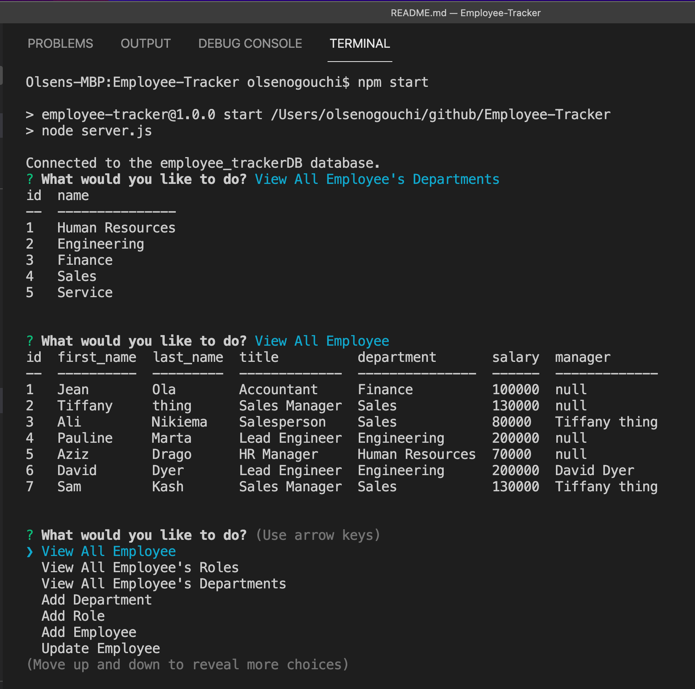

# Employee-Tracker

## Description
Employee Tracker is a CLI applicaiton for building and maintaining companies employee data base, using Node.js, Inquirer and MySQL. It allow the responsible manager of the company  to view all employees, roles, as well as departments. It also allows for adding employees, roles, departments and updating employees all from the CLI.

## Core Skills

* Node.js
* Inquirer
* MySQL (SQL queries)
* Console.log table

## Mock-Up

## Review

* Video demo that showcase the utilization of the app
  * [demo](https://watch.screencastify.com/v/NaKtlWTMKKu3IKk9soZk)

* The URL of the GitHub repository 
* [Repository](https://github.com/Chrisolsen1993/Employee-Tracker)

